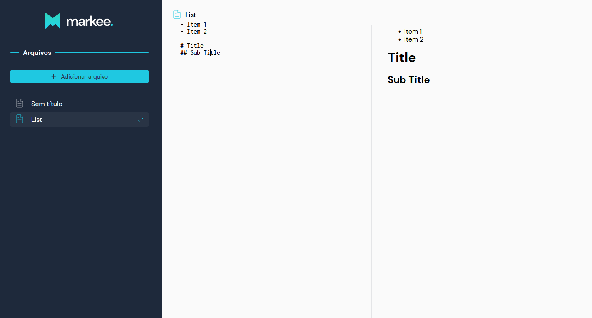

<div align="center">
  
</div>

**Markee App** is a markdown editor developed during [B.Academy's ReactJS Bootcamp](https://brainn.co/).

<!--- ### [🟢 See live]() -->

<p align="center">
  <a href="/" target="_blank" style="display: block;">
    
  </a>
  <!--- <a href="/" target="_blank" style="display: block;">
    
  </a>
  <a href="/" target="_blank" style="display: block;">
    
  </a> -->
</p>

# 🎮 Getting started

<h3 style="font-size: 18px;">🧬 Clone this repository</h3>

```bash
git clone https://github.com/leoander01/markee-app.git
```

<h3 style="font-size: 18px;">📂 Move yourself to the appropriate repository</h3>

```bash
cd markee-app
```

<h3 style="font-size: 18px;">🎉 Install the package dependencies</h3>

```bash
npm install
# or
yarn
```

# 🔥 Usage

```bash
npm run dev
# or
yarn dev
```

Open [http://localhost:3000](http://localhost:3000) to view it in the browser.

# 🍷 Build

```bash
npm run build
# or
yarn build
```

Builds the app for production to the `build` folder.

# 🚀 Techs

- React
- TypeScript
- Styled Components
- LocalForage
- Marked
- Highlight.js
- Husky
- ESLint
- EditorConfig

# 👨🏻‍💻 Author

- GitHub: [leoander01](https://github.com/leoander01)
- LinkedIn: [Leoander Neves](https://www.linkedin.com/in/leoander-neves)

# ✨ Show your support

Give a ⭐ if this project helped you or if you liked it!
